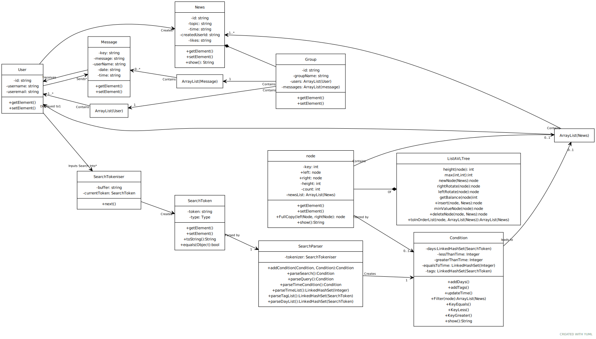

# [G37] Report

## Table of Contents

1. [Team Members and Roles](#team-members-and-roles)
2. [Summary of Individual Contributions](#summary-of-individual-contributions)
3. [Application Description](#application-description)
4. [Application UML](#application-uml)
5. [Application Design and Decisions](#application-design-and-decisions)
6. [Summary of Known Errors and Bugs](#summary-of-known-errors-and-bugs)
7. [Testing Summary](#testing-summary)
8. [Implemented Features](#implemented-features)
9. [Team Meetings](#team-meetings)
10. [Conflict Resolution Protocol](#conflict-resolution-protocol)

## Administrative
- Firebase Repository Link: <insert-https://console.firebase.google.com/project/comp2100-groupproject/overview>
   - Confirm: I have already added comp21006442@gmail.com as an Editior to the Firebase project prior to due date.
 
- Two user accounts for markers' access are usable on the app's APK (do not change the username and password unless there are exceptional circumstances. Note that they are not real e-mail addresses in use):
   - Username: comp2100@anu.edu.au	Password: comp2100
   - Username: comp6442@anu.edu.au	Password: comp6442

## Team Members and Roles
The key area(s) of responsibilities for each member

| UID   |  Name  |   Role |
|:------|:------:|-------:|
| [U6943144] | [Jack] | [Database and Search Functionality] |
| [u7731298] | [Davina] | [Firebase, Base App and Chat Functionality and UI] |

## Summary of Individual Contributions

1. **u6943144, Jack Brown**  I have 50% contribution, as follows:  
  - **Code Contribution in the final App**
    - Feature DataFiles - class ListAVLTree: [ListAVLTree.java](https://gitlab.cecs.anu.edu.au/u6943144/comp2100groupproject/-/blob/main/Group_Project/app/src/main/java/com/example/groupprojectapplication/ListAVLTree.java)
    - Feature Search - class SearchToken: [SearchToken.java](https://gitlab.cecs.anu.edu.au/u6943144/comp2100groupproject/-/blob/main/Group_Project/app/src/main/java/com/example/groupprojectapplication/SearchToken.java)
                     - class SearchTokeniser: [SearchTokeniser.java](https://gitlab.cecs.anu.edu.au/u6943144/comp2100groupproject/-/blob/main/Group_Project/app/src/main/java/com/example/groupprojectapplication/SearchTokeniser.java)
                     - class SearchParser: [SearchParser.java](https://gitlab.cecs.anu.edu.au/u6943144/comp2100groupproject/-/blob/main/Group_Project/app/src/main/java/com/example/groupprojectapplication/SearchParser.java)
                     - class LocalDataManager: [LocalDataManager.java](https://gitlab.cecs.anu.edu.au/u6943144/comp2100groupproject/-/blob/main/Group_Project/app/src/main/java/com/example/groupprojectapplication/LocalDataManager.java)
                     - class Condition: [Condition.java](https://gitlab.cecs.anu.edu.au/u6943144/comp2100groupproject/-/blob/main/Group_Project/app/src/main/java/com/example/groupprojectapplication/Condition.java)
    - Feature LoadShowData - class NewsFragment: [NewsFragment.java](https://gitlab.cecs.anu.edu.au/u6943144/comp2100groupproject/-/blob/main/Group_Project/app/src/main/java/com/example/groupprojectapplication/fragments/NewsFragment.java)
    - Composite Design Pattern -  class ListAVLTree: [ListAVLTree.java](https://gitlab.cecs.anu.edu.au/u6943144/comp2100groupproject/-/blob/main/Group_Project/app/src/main/java/com/example/groupprojectapplication/ListAVLTree.java)
    - Singleton Design Pattern -  class Condition: [Condition.java](https://gitlab.cecs.anu.edu.au/u6943144/comp2100groupproject/-/blob/main/Group_Project/app/src/main/java/com/example/groupprojectapplication/Condition.java)
    - Unit Testing - class ExampleUnitTest.java [ExampleUnitTest.java](https://gitlab.cecs.anu.edu.au/u6943144/comp2100groupproject/-/blob/main/Group_Project/app/src/test/java/com/example/groupprojectapplication/ExampleUnitTest.java)   

  - **Code and App Design** 
    - Designed Data Structure, Tokeniser, Parser, Searcher.
    - Proposed the high level concept of the app.
    - Assisted in Design Disucssion about UI, mostly supporting Davina in coming to design conclusions*   

  - **Others**: (only if significant and significantly different from an "average contribution") 
    - Focused on Writing the report*
    - Created the presentation slides
  

2. **u7731298, Davina Lydia Pinto**  I have 50% contribution, as follows:  
- **Code contribution in final app**
   - Builder Design Pattern -  class AddNewsActivity: [AddNewsActivity.java](https://gitlab.cecs.anu.edu.au/u6943144/comp2100groupproject/-/blob/main/Group_Project/app/src/main/java/com/example/groupprojectapplication/AddNewsActivity.java)
   - Feature Register and Login user
      - Main page to go to login and Register 
         - class MainActivity: [MainActivity.java](https://gitlab.cecs.anu.edu.au/u6943144/comp2100groupproject/-/blob/main/Group_Project/app/src/main/java/com/example/groupprojectapplication/MainActivity.java)
         - xml activity_main.xml: [activity_main.xml](https://gitlab.cecs.anu.edu.au/u6943144/comp2100groupproject/-/blob/main/Group_Project/app/src/main/res/layout/activity_main.xml)
      - login page 
         - class LoginActivity: [LoginActivity.java](https://gitlab.cecs.anu.edu.au/u6943144/comp2100groupproject/-/blob/main/Group_Project/app/src/main/java/com/example/groupprojectapplication/LoginActivity.java)
         - xml activity_login.xml: [activity_login.xml](https://gitlab.cecs.anu.edu.au/u6943144/comp2100groupproject/-/blob/main/Group_Project/app/src/main/res/layout/activity_login.xml)
      - register page
         -class RegisterActivity: [RegisterActivity.java](https://gitlab.cecs.anu.edu.au/u6943144/comp2100groupproject/-/blob/main/Group_Project/app/src/main/java/com/example/groupprojectapplication/RegisterActivity.java)
         -xml activity_register.xml: [activity_register.xml](https://gitlab.cecs.anu.edu.au/u6943144/comp2100groupproject/-/blob/main/Group_Project/app/src/main/res/layout/activity_register.xml)
   - Feature Main home page of app with fragments of StudyGoupNews, Group message and Chat
      - Main Page with tabs
         - class MainPageAcitivity: [MainPageActivity.java](https://gitlab.cecs.anu.edu.au/u6943144/comp2100groupproject/-/blob/main/Group_Project/app/src/main/java/com/example/groupprojectapplication/MainPageActivity.java)
         - xml activity_mainpage.xml:[activity_mainpage.xml](https://gitlab.cecs.anu.edu.au/u6943144/comp2100groupproject/-/blob/main/Group_Project/app/src/main/res/layout/activity_main_page.xml)
         - Adapter for the fragments to be added to the home page(MainPageActivity)
         - class ViewPageAdapter : [ViewPageAdapter.java](https://gitlab.cecs.anu.edu.au/u6943144/comp2100groupproject/-/blob/main/Group_Project/app/src/main/java/com/example/groupprojectapplication/ViewPageAdapter.java)
      - Study group news fragment
         - class NewsFragment: [NewsFragment.java](https://gitlab.cecs.anu.edu.au/u6943144/comp2100groupproject/-/blob/main/Group_Project/app/src/main/java/com/example/groupprojectapplication/fragments/NewsFragment.java)
         - xml fragment_news.xml: [fragment_news.xml](https://gitlab.cecs.anu.edu.au/u6943144/comp2100groupproject/-/blob/main/Group_Project/app/src/main/res/layout/fragment_news.xml)
         - adapter for recycler view: [ItemsAdapter.java](https://gitlab.cecs.anu.edu.au/u6943144/comp2100groupproject/-/blob/main/Group_Project/app/src/main/java/com/example/groupprojectapplication/ItemsAdapter.java)
         - custom layout for each item: [custom_item_layout.xml](https://gitlab.cecs.anu.edu.au/u6943144/comp2100groupproject/-/blob/main/Group_Project/app/src/main/res/layout/custom_item_layout.xml)
      - Groups: this feature enables users to chat amongst others in the study group
         - class GroupFragment:[GroupsFragment.java](https://gitlab.cecs.anu.edu.au/u6943144/comp2100groupproject/-/blob/main/Group_Project/app/src/main/java/com/example/groupprojectapplication/fragments/GroupsFragment.java)
         - xml fragment_groups.xml:[fragment_groups.xml](https://gitlab.cecs.anu.edu.au/u6943144/comp2100groupproject/-/blob/main/Group_Project/app/src/main/res/layout/fragment_groups.xml)
         - Main group chat activity:
            - class GroupChatActivity.java:[GroupChatActivity.java](https://gitlab.cecs.anu.edu.au/u6943144/comp2100groupproject/-/blob/main/Group_Project/app/src/main/java/com/example/groupprojectapplication/GroupChatActivity.java)
            - xml activity_group_chat.xml:[activity_group_chat.xml](https://gitlab.cecs.anu.edu.au/u6943144/comp2100groupproject/-/blob/main/Group_Project/app/src/main/res/layout/activity_group_chat.xml)
      - Chats: this feature enables users to message other users privately
         - class ChatsFragment:[ChatsFragment.java](https://gitlab.cecs.anu.edu.au/u6943144/comp2100groupproject/-/blob/main/Group_Project/app/src/main/java/com/example/groupprojectapplication/fragments/ChatsFragment.java)
         - xml fragment_chats.xml:[fragment_chats.xml](https://gitlab.cecs.anu.edu.au/u6943144/comp2100groupproject/-/blob/main/Group_Project/app/src/main/res/layout/fragment_chats.xml)
         - adatper for chats recycler view: [ChatsAdapter.java](https://gitlab.cecs.anu.edu.au/u6943144/comp2100groupproject/-/blob/main/Group_Project/app/src/main/java/com/example/groupprojectapplication/ChatsAdapter.java)
         - custom layout for chat contacts:[custom_chat_item.xml](https://gitlab.cecs.anu.edu.au/u6943144/comp2100groupproject/-/blob/main/Group_Project/app/src/main/res/layout/custom_chat_item.xml)
         - Main Chat Activity 
            - class ChatActivity.java: [ChatActivity.java](https://gitlab.cecs.anu.edu.au/u6943144/comp2100groupproject/-/blob/main/Group_Project/app/src/main/java/com/example/groupprojectapplication/ChatActivity.java)
            - xml activity_chat.xml: [activity_chat.xml](https://gitlab.cecs.anu.edu.au/u6943144/comp2100groupproject/-/blob/main/Group_Project/app/src/main/res/layout/activity_chat.xml)
   - Feature Menu items with Logout, Profile, Requests and Add Study Group
      - changes are made to MainPageActivity
   - Feature Display Details of study group and creator with option to like study group, join group chat and message the group creator, this feature gives the users a better idea of the study group and it's creator
      - class NewsDetailsActivity :[NewsDetailsActivity.java](https://gitlab.cecs.anu.edu.au/u6943144/comp2100groupproject/-/blob/main/Group_Project/app/src/main/java/com/example/groupprojectapplication/NewsDetailsActivity.java)
      - xml activity_news_details.xml : [activity_news_details.xml](https://gitlab.cecs.anu.edu.au/u6943144/comp2100groupproject/-/blob/main/Group_Project/app/src/main/res/layout/activity_news_details.xml)
   - Feature Profile to ability to view created study groups and liked study groups, this feature allows the user to keep track of their own study groups as well as groups they might have liked
      - class ProfileActivity:[ProfileActivity.java](https://gitlab.cecs.anu.edu.au/u6943144/comp2100groupproject/-/blob/main/Group_Project/app/src/main/java/com/example/groupprojectapplication/ProfileActivity.java)
      - xml activity_profile.xml:[activity_profile.xml](https://gitlab.cecs.anu.edu.au/u6943144/comp2100groupproject/-/blob/main/Group_Project/app/src/main/res/layout/activity_profile.xml)
   - Feature Add study group, this feature allows a user to add a study group
      - class AddNewsActivity.java: [AddNewsActivity.java](https://gitlab.cecs.anu.edu.au/u6943144/comp2100groupproject/-/blob/main/Group_Project/app/src/main/java/com/example/groupprojectapplication/AddNewsActivity.java)
      - xml activity_add_news.xml: [activity_add_news.xml](https://gitlab.cecs.anu.edu.au/u6943144/comp2100groupproject/-/blob/main/Group_Project/app/src/main/res/layout/activity_add_news.xml)
   - Feature Requests
      - class RequestsActivity.java: [RequestsActivity.java](https://gitlab.cecs.anu.edu.au/u6943144/comp2100groupproject/-/blob/main/Group_Project/app/src/main/java/com/example/groupprojectapplication/RequestsActivity.java)
      - xml activity_requests.xml: [activity_requests.xml](https://gitlab.cecs.anu.edu.au/u6943144/comp2100groupproject/-/blob/main/Group_Project/app/src/main/res/layout/activity_requests.xml)
      - adapter for recycler view: [RequestsAdapter.java](https://gitlab.cecs.anu.edu.au/u6943144/comp2100groupproject/-/blob/main/Group_Project/app/src/main/java/com/example/groupprojectapplication/RequestsAdapter.java)
      - custom layout for recycler view :[custom_request_item.xml](https://gitlab.cecs.anu.edu.au/u6943144/comp2100groupproject/-/blob/main/Group_Project/app/src/main/res/layout/custom_request_item.xml)
   - Model classes
      - class [Chat.java](https://gitlab.cecs.anu.edu.au/u6943144/comp2100groupproject/-/blob/main/Group_Project/app/src/main/java/com/example/groupprojectapplication/model/Chat.java)
      - class [Group.java](https://gitlab.cecs.anu.edu.au/u6943144/comp2100groupproject/-/blob/main/Group_Project/app/src/main/java/com/example/groupprojectapplication/model/Group.java)
      - class [Message.java](https://gitlab.cecs.anu.edu.au/u6943144/comp2100groupproject/-/blob/main/Group_Project/app/src/main/java/com/example/groupprojectapplication/model/Message.java)
      - class [News.java](https://gitlab.cecs.anu.edu.au/u6943144/comp2100groupproject/-/blob/main/Group_Project/app/src/main/java/com/example/groupprojectapplication/model/News.java)
      - class [User.java](https://gitlab.cecs.anu.edu.au/u6943144/comp2100groupproject/-/blob/main/Group_Project/app/src/main/java/com/example/groupprojectapplication/model/User.java)
   - Helper class for conversion of day of the week and time
      - class [ConvertTimeDay.java](https://gitlab.cecs.anu.edu.au/u6943144/comp2100groupproject/-/blob/main/Group_Project/app/src/main/java/com/example/groupprojectapplication/ConvertTimeDay.java)

- **Overall contribution**
   - Design and implementation of the code that interacts with firebase
   - Made judgement calls about the firebase database and how the data will be stored.
   - UI design and implementation
   - Video and parts of the report.

## Application Description

StudySearch is an education administation app which focuses of provideing students with a forum to find weekly study groups. 
The application allows students to search for study groups based off their time and rating. 
Students can then access a group chat linked to a study group in order to connect with students in their study groups. 
Students can register profiles and create their own study groups to administrate, allowing them to manage the users allowed access to the associated group chats.

### Application Use Cases and or Examples

Here is an example of a student who wishes to find a study group

Stefan wants to study in a group because he is finding the organisational structure of COMP2100 very difficult.

Sadly, like many students, Stefan works multiple days a week and so only has time to study on a Monday Evening.
Stefan searches the app for study groups which are held after 4PM but before 10PM on a Monday.
He can see that there are several groups in this time period, the top result "COMP2100 Protest Group" has many likes associated with it.
Stefan attempts to join the group and a request message is sent to the groups owner Alice.
Alice sees no issue with allowing Stefan into the group and approves his request. 
Once in the group chat Stefan is told the details of the study group, the topics they cover and where they meet.
Stefan can now attend the study group and has many friends with which to bemoan why anyone would run a course this way.

 

### Application UML

  

## Code Design and Decisions

-Parser Description
   The Parser is developed to search apon the key of the data structure; the time at which a study group is held
   It also includes the ability to search on "Tags" as a proof of concept for searches of a different motivation
   The formal grammar consists of a repeatable structure where there is a KeyField followed by a Comparetor then a value or list of values.
   Keyfields Inlcude (DAY) (TIME) (TAG)
   (DAY) and (TAG) can only take the Contains Comparetor : while time can have Greater than > or Less Than <
   The values of (DAY) can be short forms of the days eg. Mon, Tue, Thurs etc.
   (TIME) values must be a number which can represent a 24h time value eg. 0645, 1530 etc.
   (TAG) values can take any string eg. Albert

-Parser Motivation
   As I will explain later, the Data Structure is a modified AVL Tree keyed on the time value of a Study Group.
   This key encompasses both the day of the week and time of the study session, however the parser has broken this apart and treats the day and the time as seperate components. This was an intentional choice made because it is natural to filter by a certain day and between a range of times.
   This means that while the (DAY) and (TIME) fields seems like they search on different aspects they actually run a search on the same value. 
   The Parsers makes several assumptions to bridge this gap
      If the (DAY) field is left blank the Parser will fill it with every Day and apply the other conditions on every day of the week.
      If the (TIME) field is left blank the Parser will assume that the user wishes to find all times on the selected days.

- Data Structure Motivation
   The data structure used is a Modified AVL Tree. 
   A regular AVL tree will discard any values inserted which have a duplicate key. The modified data stucture has each node containing a list of objects, if an object is added to the tree which has the same key value it will be added to the list and the node will keep track of how many items are in the list.
   This was motivated by the use case of the application, it is not unlikely that users will wish to have their study group be at the same time as another, therefore duplicates should not be discarded
   The methods for inserting and deleting nodes needed to be altered to fit this new data struture.
   An AVL tree was chosen to make searching based off the key as efficient as possible 

-Search Workflow Motivation
   The User inputs a string which is tokenised and parsed. Ther parser does not actually affect the data struture in anyway but instead produces a Condition. The condition is a singleton design pattern which contains the current filter being applied to the data struture. 
   This was an intentional choice made for the efficency of the search, if the Parser altered the data structure token by token this would result in repeating searches and possible errors as edge cases became more prevalent.
   By building a data strutcure which contains the finalised restrictions from the search input the data structure can be search in the most effiecient way possible. Futhermore, altering the data structure does not need to have the search input re-parsed as the Condition is still stored and accessible. 

### Data Structures

We used the following data structures in our project:

1. ListAVLTree
   * Objective: used for storing News for the app display
   * Code Locations: defined in [Class ListAVLTree.java](https://gitlab.cecs.anu.edu.au/u6943144/comp2100groupproject/-/blob/main/Group_Project/app/src/main/java/com/example/groupprojectapplication/ListAVLTree.java) 
   * Reasons:
      * It was an efficent way for storing a large data set in an easily searchable manner
      * Was modified based off of the regular AVL Tree in order to match our needs better 
      * Motivation described above

2. LinkedHashSet
   * Objective: used for storing restrictions in Condition
   * Code Locations: defined in [Class Condition.java](https://gitlab.cecs.anu.edu.au/u6943144/comp2100groupproject/-/blob/main/Group_Project/app/src/main/java/com/example/groupprojectapplication/Condition.java) 
   * Reasons:
      * LinkedHashSets nativley ignore duplicates and indulging duplicate restrictions has no purpose
      * There is no reason to ever get a specific value as we simply iterate over the entire set

3. ArrayList
   * Objective: used for storing Objects in Various Locations
   * Code Locations: defined in [Class ListAVLTree.java, in node](https://gitlab.cecs.anu.edu.au/u6943144/comp2100groupproject/-/blob/main/Group_Project/app/src/main/java/com/example/groupprojectapplication/ListAVLTree.java) and [Class Group.java](https://gitlab.cecs.anu.edu.au/u6943144/comp2100groupproject/-/blob/main/Group_Project/app/src/main/java/com/example/groupprojectapplication/model/Group.java)
   * Reasons:
      * ArrayLists allow for the easy removal and retrival of specific items which is required for several use cases
      * There is no reason to ever get a specific value as we simply iterate over the entire set

### Design Patterns

1. Singleton Pattern
   * Objective: used for storing Conditions for Search feature.
   * Code Locations: defined in [Class Condition](https://gitlab.cecs.anu.edu.au/u6943144/comp2100groupproject/-/blob/main/Group_Project/app/src/main/java/com/example/groupprojectapplication/Condition.java); processed using [SearchParser.java](https://gitlab.cecs.anu.edu.au/u6943144/comp2100groupproject/-/blob/main/Group_Project/app/src/main/java/com/example/groupprojectapplication/SearchParser.java)
   * Reasons:
      * The Condition is accessed from multiple locations and changed in a varying number of ways by the Search Parser
      * Having only one instance of the Condition means that there will not be duplicates of the condition to confuse the code
      * This could have been a data structure with multiple instances but having only one was streamlines and prevents mistakes

2. Composite Pattern
   * Objective: used for storing nodes for News Data set.
   * Code Locations: defined in [Class ListAVLTree.java](https://gitlab.cecs.anu.edu.au/u6943144/comp2100groupproject/-/blob/main/Group_Project/app/src/main/java/com/example/groupprojectapplication/ListAVLTree.java)
   * Reasons:
      * Having a recursive container structure allows for the easy creation of a sub structure based of a filter
      * The search feature applied to the dataset needs to return a smaller dataset, the composite feature allows us to choose a sub container to be the new super level and thus an entire data struture can be recovered very easily
      * This could have been done with a simple list, but this would be expensive to search and to copy when required

3. Buider Pattern
   * Objective: used to create groups when study group object is created through AddNewsActivity
   * Code Locations:  defined in [AddNewsActivity.java](https://gitlab.cecs.anu.edu.au/u6943144/comp2100groupproject/-/blob/main/Group_Project/app/src/main/java/com/example/groupprojectapplication/AddNewsActivity.java)
   * Reasons:
      * For every study group news there needs to be a group created simultaneous
      * The created study group has to be added in the user's created study groups list and the user has to be added to the group chat as a memeber.
      * The numerous steps are handled together.

### Parser

### <u>Grammar(s)</u>
The grammar is designed to parse the time key on which the AVLtree is based in a natural language manner.
It also incorporates the other features such as the optional sort and Tag feature, described above.

Production Rules:

    <search>         ::=  <query> | <query> ; <search>
    <query>          ::=  <TimeField> <timeCondition> | <DayField> : <dayList> | <TagField> : <tagList> | <ALTSORT>
    <timeCondition>  ::=  :<timeList>| > <Time> |< <Time>
    <dayList>        ::= <Day> | <Day> , <dayList>
    <tagList>        ::= <Tag> | <Tag> , <tagList>
    <timeList>       ::= <Time> | <Time>, <timeList>

### <u>Tokenizers and Parsers</u>

The tokeniser converts the search input string into tokens which then develop a condition to apply to the dataset.
This is beneficial because the search string can be inputted in a more natural language manner and then parsed into a format which the program can eaily understand

### <u>Firebase</u>

Firebase authentication enables simple email-password authentication with ease of password change.
We are using firebase realtime database to store our data, it uses data synchronization, every time data changes, the devices connected are updated within milliseconds. This feature allows us to easily incorporate chat capabilities; every user in the group receives messages within seconds of them being sent. 

 

## Implemented Features
*[What features have you implemented? where, how, and why?]*  
*List all features you have completed in their separate categories with their featureId. THe features must be one of the basic/custom features, or an approved feature from Voice Four Feature.*

### Basic Features
1. [LogIn]. Allows a user to register a Profile and Login with it (easy)
   * Code: [Class Login](https://gitlab.cecs.anu.edu.au/u6943144/comp2100groupproject/-/blob/main/Group_Project/app/src/main/java/com/example/groupprojectapplication/LoginActivity.java) and [Class Register](https://gitlab.cecs.anu.edu.au/u6943144/comp2100groupproject/-/blob/main/Group_Project/app/src/main/java/com/example/groupprojectapplication/RegisterActivity.java)
   * Description of feature:  The feature allows a user to login such that they retain an identity while in the app 
   * Description of your implementation: We used Firebase Authentication to allow a user to login with a google email and password. The user also remains logged in if they close and reopen the app  

2. [DataFiles]. The user can search apon a space of 2500+ study group topics (easy)
   * There is a local stroage of the Data File [localTopics.csv](https://gitlab.cecs.anu.edu.au/u6943144/comp2100groupproject/-/blob/main/Group_Project/app/src/main/assets/localTopicsCopy.csv)
   * Link to the Firebase repo: https://console.firebase.google.com/project/comp2100-groupproject/overview
   * The data was uploaded using [LocalDataManager.java](https://gitlab.cecs.anu.edu.au/u6943144/comp2100groupproject/-/blob/main/Group_Project/app/src/main/java/com/example/groupprojectapplication/LocalDataManager.java)

3. [LoadShowData]. The Data is loaded from firebase in realtime alongside changes (medium)
   * Code: [Class NewsFragment.java](https://gitlab.cecs.anu.edu.au/u6943144/comp2100groupproject/-/blob/main/Group_Project/app/src/main/java/com/example/groupprojectapplication/fragments/NewsFragment.java), [Class ChatActivity.java](https://gitlab.cecs.anu.edu.au/u6943144/comp2100groupproject/-/blob/main/Group_Project/app/src/main/java/com/example/groupprojectapplication/ChatActivity.java)
   * Description of feature: The user can view realtime data, this may be the filtered list of Study Topics or the messages in a chat 
   * Description of your implementation: We used Firebase realtime database alongside android studios UI language in order to redisplay data on changes to the realtime database in order allow the user access to the most current data  

4. [Search]. Allow the user to input a string which apply a search to the data (medium)
   * Code:[SearchToken.java](https://gitlab.cecs.anu.edu.au/u6943144/comp2100groupproject/-/blob/main/Group_Project/app/src/main/java/com/example/groupprojectapplication/SearchToken.java),[SearchTokeniser.java](https://gitlab.cecs.anu.edu.au/u6943144/comp2100groupproject/-/blob/main/Group_Project/app/src/main/java/com/example/groupprojectapplication/SearchTokeniser.java),[SearchParser.java](https://gitlab.cecs.anu.edu.au/u6943144/comp2100groupproject/-/blob/main/Group_Project/app/src/main/java/com/example/groupprojectapplication/SearchParser.java),[Condition.java](https://gitlab.cecs.anu.edu.au/u6943144/comp2100groupproject/-/blob/main/Group_Project/app/src/main/java/com/example/groupprojectapplication/Condition.java)
   * Description of feature: The user can use natural(ish) language to apply a search condition to the data which is displayed 
   * Description of your implementation: A search string is tokenised and then parsed in order to alter a Condition which is used to filter the data. The filtered data is then displayed 
    

### Custom Features
Feature Category: Search-related features  
1. [Search Filter]. Sort and filter a list of items returned from searches, with the use of suitable UI components (easy)
   * Code: [Class NewsFragment](https://gitlab.cecs.anu.edu.au/u6943144/comp2100groupproject/-/blob/main/Group_Project/app/src/main/java/com/example/groupprojectapplication/fragments/NewsFragment.java)
   * Description of your implementation: The user can input a search string which can include an optional tag to sort the results by their likes instead of by the time they are held. This returned list is displayed in the Recycler View Activity for display and interactability for the user 
      

Feature Category: Greater Data Usage, Handling and Sophistication  
2. [Data-Profile]. Create a Profile Page for Users or any Entities, which contains a media file (easy)
   * Code: [Class ProfileActivity](https://gitlab.cecs.anu.edu.au/u6943144/comp2100groupproject/-/blob/main/Group_Project/app/src/main/java/com/example/groupprojectapplication/fragments/NewsFragment.java)
   * Description of your implementation: Each user has details stored on FireBase which can be accessed and displayed from the User's profile. This included an image which represents them  
      

Feature Category: Firebase Integration  
3. [FB-Auth]. Use Firebase to implement User Authentication/Authorisation. (easy)
   * Code: [Class LoginActivity](https://gitlab.cecs.anu.edu.au/u6943144/comp2100groupproject/-/blob/main/Group_Project/app/src/main/java/com/example/groupprojectapplication/LoginActivity.java),[Class RegisterActivity](https://gitlab.cecs.anu.edu.au/u6943144/comp2100groupproject/-/blob/main/Group_Project/app/src/main/java/com/example/groupprojectapplication/RegisterActivity.java)
   * Description of your implementation: Users can register and login using Firebase Authentication, they stay logged in even if they leave the app and come back in as we have set up otp session persistence 
      

4. [FB-Persist]. Use Firebase to persist all data used in your app. (Hard)
   * Code: [Class LoginActivity](https://gitlab.cecs.anu.edu.au/u6943144/comp2100groupproject/-/blob/main/Group_Project/app/src/main/java/com/example/groupprojectapplication/LoginActivity.java),[Class RegisterActivity](https://gitlab.cecs.anu.edu.au/u6943144/comp2100groupproject/-/blob/main/Group_Project/app/src/main/java/com/example/groupprojectapplication/RegisterActivity.java),[Class NewsFragment](https://gitlab.cecs.anu.edu.au/u6943144/comp2100groupproject/-/blob/main/Group_Project/app/src/main/java/com/example/groupprojectapplication/fragments/NewsFragment.java),[Class GroupsFragment](https://gitlab.cecs.anu.edu.au/u6943144/comp2100groupproject/-/blob/main/Group_Project/app/src/main/java/com/example/groupprojectapplication/fragments/GroupsFragment.java),[Class ChatsFragment](https://gitlab.cecs.anu.edu.au/u6943144/comp2100groupproject/-/blob/main/Group_Project/app/src/main/java/com/example/groupprojectapplication/fragments/ChatsFragment.java)
   * Description of your implementation: All data which can be updated is stored in firebase. Using firebases on Data added and on data changed features all data is updated as it is altered in realtime 
      

Feature Catagory: Peer to Peer Messaging  
5. [Chat Function]. Provide users with the ability to message each other directly in private . (Hard)
   * Code: [Class GroupsFragment](https://gitlab.cecs.anu.edu.au/u6943144/comp2100groupproject/-/blob/main/Group_Project/app/src/main/java/com/example/groupprojectapplication/fragments/GroupsFragment.java),[Class ChatsFragment](https://gitlab.cecs.anu.edu.au/u6943144/comp2100groupproject/-/blob/main/Group_Project/app/src/main/java/com/example/groupprojectapplication/fragments/ChatsFragment.java),[Class Message](https://gitlab.cecs.anu.edu.au/u6943144/comp2100groupproject/-/blob/main/Group_Project/app/src/main/java/com/example/groupprojectapplication/model/Message.java),[Class Group](https://gitlab.cecs.anu.edu.au/u6943144/comp2100groupproject/-/blob/main/Group_Project/app/src/main/java/com/example/groupprojectapplication/model/Group.java),[Class Chat](https://gitlab.cecs.anu.edu.au/u6943144/comp2100groupproject/-/blob/main/Group_Project/app/src/main/java/com/example/groupprojectapplication/model/Chat.java),[Class ChatActivity](https://gitlab.cecs.anu.edu.au/u6943144/comp2100groupproject/-/blob/main/Group_Project/app/src/main/java/com/example/groupprojectapplication/ChatActivity.java) 
   * Description of your implementation: We have implemented A group chat function using realtime database to spread information amongst users, far above the requirements of this task. Futhermore, with the requests feature we have implemented below this also functions and a private messaging feature  
      

Feature Catagory: Privacy  
6. [Privacy-Request]. Provide users with the ability to message each other directly in private . (Hard)
   * Code: [Class RequestsActivity](https://gitlab.cecs.anu.edu.au/u6943144/comp2100groupproject/-/blob/main/Group_Project/app/src/main/java/com/example/groupprojectapplication/RequestsActivity.java),[Class NewsDetailsActivity](https://gitlab.cecs.anu.edu.au/u6943144/comp2100groupproject/-/blob/main/Group_Project/app/src/main/java/com/example/groupprojectapplication/NewsDetailsActivity.java),[Class Groups](https://gitlab.cecs.anu.edu.au/u6943144/comp2100groupproject/-/blob/main/Group_Project/app/src/main/java/com/example/groupprojectapplication/model/Group.java)
   * Description of your implementation: When a user wishes to join a group chat they submit a request to the owner of the group which can then be accepted or denied, allowing for private messageing between two users among other uses  

### Surprise Features

1. [Item Ranking]. How to rank the items returned for a given search.
   * Code: [Class Condition, method Filter](https://gitlab.cecs.anu.edu.au/u6943144/comp2100groupproject/-/blob/main/Group_Project/app/src/main/java/com/example/groupprojectapplication/Condition.java)
   * Description of your implementation: When a certain part of the search string (ALTSORT) is entered the Condition recognises that you wish to sort the results presented by likes instead of time order  

2. [Log Past Searches]. log previous searches and user information to improve search results.
   * Code: [Class SearchHelp](https://gitlab.cecs.anu.edu.au/u6943144/comp2100groupproject/-/blob/main/Group_Project/app/src/main/java/com/example/groupprojectapplication/SearchHelp.java)
   * Description of your implementation: When a user runs a search it is saved and can be viewed in the Search help Activity. This is Firebase integrated and persists across sessions  

3. [Promoted Items]. A strategy for showing ads (promoted items).
   * Code: [Class NewsFragment](https://gitlab.cecs.anu.edu.au/u6943144/comp2100groupproject/-/blob/main/Group_Project/app/src/main/java/com/example/groupprojectapplication/fragments/NewsFragment.java),[Class News](https://gitlab.cecs.anu.edu.au/u6943144/comp2100groupproject/-/blob/main/Group_Project/app/src/main/java/com/example/groupprojectapplication/model/News.java),[Class Condition, method Filter](https://gitlab.cecs.anu.edu.au/u6943144/comp2100groupproject/-/blob/main/Group_Project/app/src/main/java/com/example/groupprojectapplication/Condition.java)
   * Description of your implementation: When a user is sorting by (ALTSORT) the first three results are reserved for promoted items, if there are not three promoted items then as many as possible are promoted and then the list continues as normal 

  

## Summary of Known Errors and Bugs

1. Emulator Crash
   - Andriod Studio is pay to win, my computer struggles to run it.
   - The lab computers run a older version of Android Studio, so we cannot run it there.
   - If the emulator trys to hard, it will just close. No error message will occur, it simply closes.

2. Slow Load
   - Since we are loading 2500+ data points from firebase it takes up to 15s to load
   - Once the data is loaded it is fast to filter and search on the data

3. Currently images are not saved   
   - Currently users cannot upload their own images, This is probably a good thing as there is no profanity filter
   - We would like to introduce the image upload in the future with a scan to ensure no profanity is present in the uploaded pictures

4. Sort Limits Options
   - The alternate sort is expensive to run on a large dataset. 
   - If a user chooses to use the alt sort the first 100 items in time order will be taken, the rest discarded.

5. Emulator crash on request accept or chat fragment after request accept
   - On request accept, a entry is created in the contact table in firebase, first the user entry is created and then the chatKey entry.
   - Sometimes the chatKey entry does not get created properly due to internet issues there are delays in the entry creation. This causes the app to crash.

6. Request accept takes time to complete
   - Multiple firebase calls are made one after the other causing the app to remain idle during processing
   - No progress bar implemented which might cause user to believe the app has paused.

7. Chat fragment has multiple records of the same user
   - Due to the delay in retrieving data from firebase, sometimes there can be multiple records added to the chat fragment
   
  

## Testing Summary

1. Tests for Search and DataBase
   - Code: [ExampleUnitTest Class](https://gitlab.cecs.anu.edu.au/u6943144/comp2100groupproject/-/blob/main/Group_Project/app/src/test/java/com/example/groupprojectapplication/ExampleUnitTest.java) 
   - Code coverage: This Unit testing covers as much of the offline features as possible
   - Actions on the database are tested
   - tokenisation correct value and error handling is tested
   - parseing correct value and error handling is tested
   - Condition developing correct value and error handling is tested
   - Condition Filtering correct value and error handling is tested
   - There are some sections which are not covered, The suprise features as less covered although they do have some coverage

2. Manual Testing
   - Everything which could not be tested with a unit test was tested manulaly with the emulator
   - We could not make unit tests for anything involving realtime database because that would require an android mock emulator which is beyond the scope of this course

  

## Team Management

### Meetings Records

- [Meeting 26/09/23](https://gitlab.cecs.anu.edu.au/-/ide/project/u6943144/comp2100groupproject/tree/main/-/Items/Meeting%20Notes%2026092023.txt/)
- [Meeting 3/10/23](https://gitlab.cecs.anu.edu.au/-/ide/project/u6943144/comp2100groupproject/tree/main/-/Items/3102023%20Meeting%20Minutes.txt/)
- [Meeting 9/10/23](https://gitlab.cecs.anu.edu.au/-/ide/project/u6943144/comp2100groupproject/tree/main/-/Items/Meeting%20Minutes%209102023.txt/)
- [Meeting 10/10/23 Progressivly updated](https://gitlab.cecs.anu.edu.au/-/ide/project/u6943144/comp2100groupproject/tree/main/-/Items/Meeting%20minutes%2010102023.txt/)
- [Meeting 17/10/23](https://gitlab.cecs.anu.edu.au/u6943144/comp2100groupproject/-/blob/main/Items/Meeting%20Minutes%20171023.txt)

### Conflict Resolution Protocol
Since we are just two people our conflict resolution protocol is very simple
   - Have well established primary decider on aspects of the application
      eg. Davina: Chat function, UI design
          Jack: Search, Database and Testing
   - Where disagreement would impact entire project or grey area decide on resolution plan
      eg. An ambitious feature may delay the project, Jack thinks we should not attempt it but Davina thinks it will be good
         decide on resolution plan: If feature is not up to a certain level of functionality by this date then it is deleted and we move on
